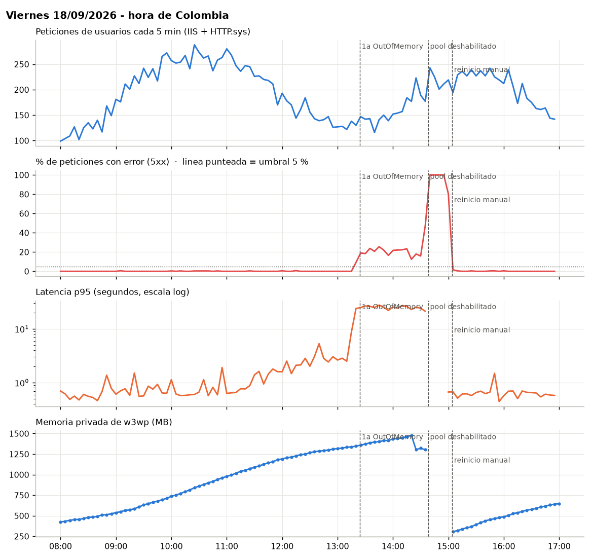
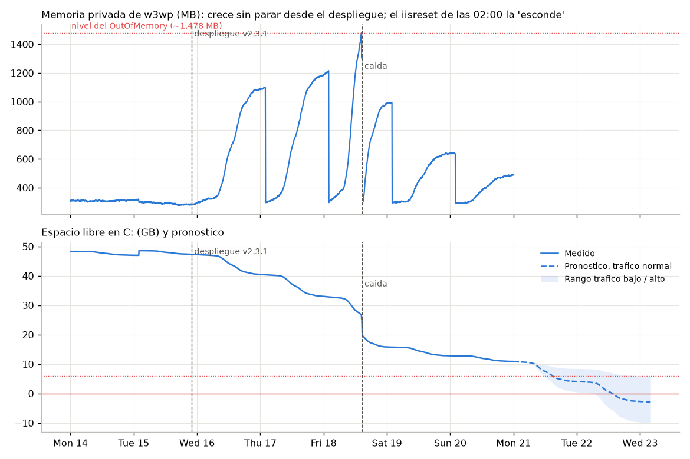
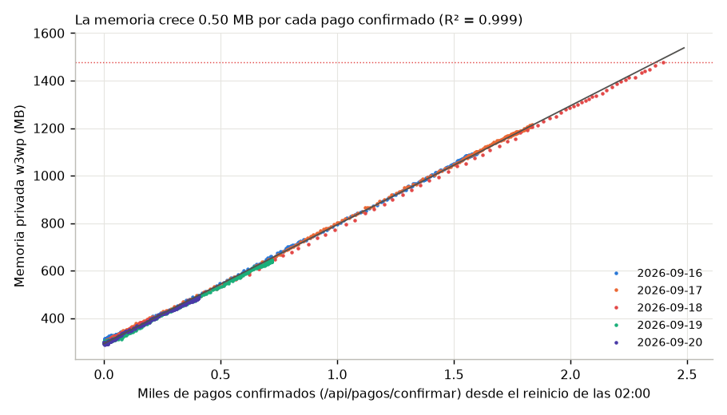

# Reto 1 - Resultados generados por `analisis.py`

Todas las horas en hora de Colombia (UTC-5). Archivo generado: no editar a mano. Version visual: `reporte.html`.

| Indicador | Valor | Detalle |
|---|---|---|
| Disponibilidad real viernes 18/09 | 94,2 % | 1.626 operaciones fallidas |
| Disponibilidad real de la semana | 98,5 % | por operacion de usuario |
| Lo que reporto el NOC | 100 % | su propio sondeo /health: 99,74 % |
| Caida total | 26 min | 14:38 a 15:04 · degradacion desde 11:30 |
| Fuga de memoria | 0,50 MB | por pago confirmado · limite ~2.369 pagos entre reinicios |
| Disco C: lleno (trafico normal) | mar 22/09 14:00 | quedan 10,9 GB · 6,8 GB/dia |

## 1. Calidad de los datos

Los archivos llegan sin depurar. Estas decisiones de limpieza cambian las conclusiones.

| Tema | Hallazgo y tratamiento |
|---|---|
| Archivo duplicado | `u_ex260916 - copia.log` es identico (SHA-256) a `u_ex260916.log`; se carga una sola vez. |
| Zona horaria | IIS y HTTP.sys escriben en UTC: `u_ex260914.log` empieza a las 05:00 UTC (00:00 en Colombia) y `u_ex260921.log` solo llega a las 04:59 UTC. Se restan 5 h. Eventos y Perfmon ya estan en hora local. |
| Cambio de esquema W3C | `u_ex260917.log` cambia de campos en la linea 2351: se agregan `cs-host` y `X-Forwarded-For`. Desde ahi `c-ip` es el balanceador 10.20.4.4 y la IP real del cliente viene en `X-Forwarded-For`. |
| Huecos en Perfmon | 13 muestras sin valor de `Process(w3wp)\Private Bytes` (lineas 332, 364, 512, 813, 847, 884, 1330, 1331, 1332, 1333, 1334, 1535, 1618). Coinciden con momentos sin proceso w3wp (reinicios y la caida). Se tratan como nulos, no como cero. |
| Log del mantenimiento | `mantenimiento.log` tiene 30 lineas 'Proceso OK' sin fecha ni detalle; el .BAT lo escribe siempre, falle o no. No sirve como evidencia. |
| Eventos incompletos | La exportacion no tiene el evento del reinicio manual del pool a las 15:04 (solo consta en el ticket T-10255). Tampoco hay eventos 'stopped' del Servicio Notificaciones, solo 'running'. |
| Ruido | Sondeo del NOC (`NOC-HealthProbe`, 20101 peticiones) y escaneres (zgrab y rutas como /.env, 1772 peticiones) se excluyen del calculo de usuarios reales. |
| HTTP.sys | `httperr1.log` tiene 1541 respuestas 503 AppOffline que **no aparecen en el log de IIS**: si solo se mira IIS, la caida es invisible. |

## 2. Linea de tiempo

Hora de Colombia. Cada fila cita el archivo y la linea que la respalda.

| Hora | Fase | Qué pasó | Qué vio el usuario | Evidencia |
|---|---|---|---|---|
| mar 15/09 22:03:00 | Antecedente | Despliegue PortalPagos v2.3.1: nuevo flujo de confirmacion, cache de sesiones de pago y log en nivel Debug | Nada visible | eventos linea 109 |
| mié 16/09 11:30:02 | Antecedente | Se retira la unidad D:. Los logs pasan a C:, pero el .BAT sigue limpiando D:\logs\iis | Nada visible | eventos linea 150; mantenimiento_diario.bat |
| mié 16/09 22:12:05 | Antecedente | Aparece un balanceador/proxy delante del servidor (nuevo campo X-Forwarded-For; c-ip pasa a 10.20.4.4). No hay registro de ese cambio | Nada visible | u_ex260917.log linea 2351 |
| jue 17/09 16:10:00 | Señal ignorada | Ticket 'Portal de pagos lento en la tarde', cerrado con 'monitoreo en verde' | Lentitud | tickets T-10240 |
| vie 18/09 02:00:01 | Antecedente | iisreset nocturno: memoria de w3wp vuelve a ~300 MB | Nada visible | eventos linea 271 |
| vie 18/09 11:30:00 | Inicio de degradacion | p95 de latencia supera 1,5x la linea base (700 ms) con memoria de w3wp en 1,089 MB | Paginas algo mas lentas | u_ex260918.log; perfmon |
| vie 18/09 12:40:00 | Degradacion fuerte | p95 > 3 s | Lentitud notoria al consultar y pagar | u_ex260918.log |
| vie 18/09 13:23:08 | Primer error | Primer 500 del incidente (/api/pagos/iniciar) | Error al pagar | u_ex260918.log linea 24018 |
| vie 18/09 13:24:19 | Primer error | Primera OutOfMemoryException en SesionPagoCache.Agregar (/api/pagos/confirmar) | 'Ha ocurrido un error inesperado' | eventos linea 304 |
| vie 18/09 13:34:00 | Reporte | Primer ticket de usuarios (T-10252) | Error al confirmar pago | tickets T-10252 |
| vie 18/09 14:00:00 | Deteccion (hipotetica) | Hora de la alerta de ejemplo (5xx > 5%), si hubiera existido | - | alerta_ejemplo.json (firedDateTime 19:00Z) |
| vie 18/09 14:22:12 | Caida | Primer crash de w3wp por OutOfMemory (se genera dump) | Conexiones cortadas | eventos lineas 347-350 |
| vie 18/09 14:34:40 | Caida | Crashes en cadena: 5 entre 14:22 y 14:38 | Errores intermitentes | eventos lineas 347, 352, 356, 360, 364 |
| vie 18/09 14:38:00 | Caida total | HTTP.sys responde 503 AppOffline a todo | Service Unavailable | httperr1.log linea 5 |
| vie 18/09 14:38:05 | Caida total | Rapid-Fail Protection deshabilita PortalPagosPool | Service Unavailable (503) | eventos linea 366 |
| vie 18/09 14:42:00 | Reporte | Ticket critico T-10255 'Portal caido' | - | tickets T-10255 |
| vie 18/09 15:04:00 | Recuperacion | Reinicio manual del pool | - | tickets T-10255 (sin evento) |
| vie 18/09 15:04:00 | Recuperacion | Primera respuesta de IIS despues de la caida | Portal disponible | u_ex260918.log linea 27229 |
| vie 18/09 16:37:17 | Riesgo | Aviso del sistema: disco C: casi lleno | Nada visible (aun) | eventos linea 372 |
| dom 20/09 09:15:00 | Señal ignorada | Revision semanal NOC: 'sin novedades', /health OK 100% | - | tickets T-10270 |

## 3. Disponibilidad real vs. NOC

Usuarios reales: sin archivos estaticos, sin el sondeo del NOC y sin escaneres. `disp_tiempo_pct` cuenta ventanas de 5 min con mas de 5 % de errores y al menos 3 fallas.

| Día | Operaciones | Fallas | Disp. por operación (%) | Min. no disponible | Disp. por tiempo (%) | Sondeos NOC fallidos | Disp. según sondeo NOC (%) |
|---|---|---|---|---|---|---|---|
| lun 14/09 | 17579.0 | 30.0 | 99.83 | 0.0 | 100.0 | 0.0 | 100.0 |
| mar 15/09 | 16567.0 | 21.0 | 99.87 | 0.0 | 100.0 | 0.0 | 100.0 |
| mié 16/09 | 17546.0 | 16.0 | 99.91 | 0.0 | 100.0 | 0.0 | 100.0 |
| jue 17/09 | 19455.0 | 26.0 | 99.87 | 0.0 | 100.0 | 0.0 | 100.0 |
| vie 18/09 | 28087.0 | 1626.0 | 94.21 | 105.0 | 92.71 | 52.0 | 98.19 |
| sáb 19/09 | 7809.0 | 5.0 | 99.94 | 0.0 | 100.0 | 0.0 | 100.0 |
| dom 20/09 | 4988.0 | 3.0 | 99.94 | 0.0 | 100.0 | 0.0 | 100.0 |
| SEMANA | 112031.0 | 1727.0 | 98.46 | 105.0 | 98.96 | 52.0 | 99.74 |

Mientras los usuarios fallaban (18/09 13:20-14:38): **18.9 %** de errores y p95 de **25.4 s**; el sondeo /health respondio 200 en **156 de 156** intentos (p95 4 ms).

## 4. Señales tempranas

Desde el miercoles 16/09 la memoria pico, la latencia nocturna y el consumo de disco se multiplican frente a lunes y martes.

| Día | Memoria pico w3wp (MB) | Latencia p95 19-23 h (ms) | Errores 500 | Disco libre fin del día (GB) | Operaciones | Consumo disco (MB) | MB de disco por 1.000 operaciones |
|---|---|---|---|---|---|---|---|
| lun 14/09 | 316.7 | 727.0 | 30 | 47.0 | 17579 | nan | nan |
| mar 15/09 | 320.3 | 610.0 | 21 | 47.2 | 16567 | -239.0 | -14.4 |
| mié 16/09 | 1091.3 | 1929.4 | 16 | 40.5 | 17546 | 6884.0 | 392.3 |
| jue 17/09 | 1186.3 | 2051.6 | 26 | 33.0 | 19455 | 7656.0 | 393.5 |
| vie 18/09 | 1478.5 | 626.4 | 496 | 15.8 | 26957 | 17624.0 | 653.8 |
| sáb 19/09 | 995.2 | 1244.0 | 5 | 12.8 | 7809 | 3053.0 | 391.0 |
| dom 20/09 | 644.3 | 518.4 | 3 | 10.9 | 4988 | 1953.0 | 391.5 |

## 5. Pronostico: fuga de memoria

**0.501 MB por cada pago confirmado** (R² 0.999), partiendo de 293 MB tras el reinicio. El OutOfMemory aparecio con ~1,478 MB: se alcanza con ~2,369 confirmaciones en un mismo ciclo entre reinicios (observado el 18/09: 2,387 confirmaciones entre las 02:00 y el primer crash).

| ciclo que inicia a las 02:00 del | confirmaciones | % del limite |
|---|---|---|
| dom 13/09 | 21 | 1.0 |
| lun 14/09 | 1598 | 67.0 |
| mar 15/09 | 1543 | 65.0 |
| mié 16/09 | 1601 | 68.0 |
| jue 17/09 | 1837 | 78.0 |
| vie 18/09 | 4003 | 169.0 |
| sáb 19/09 | 720 | 30.0 |
| dom 20/09 | 407 | 17.0 |

## 6. Pronostico: disco C:

Consumo = 1 MB/h + **0.389 MB por peticion** (R² 1.00). Los dumps del 18/09 ocuparon ~7,002 MB. Libre al cierre: 10.9 GB de 119 GB.

Cada crash adicional de w3wp deja un dump de ~1,4 GB en C:\CrashDumps y adelanta el llenado.

| escenario de trafico | GB/dia | libre < 5 % | disco lleno |
|---|---|---|---|
| bajo (como fin de semana) | 2.4 | mié 23/09 02:00 | vie 25/09 12:00 |
| normal (promedio lun-jue) | 6.8 | lun 21/09 15:00 | mar 22/09 14:00 |
| alto (como el viernes 18/09) | 10.3 | lun 21/09 12:00 | mar 22/09 07:00 |

## 7. Eventos de Windows por dia

Separa ruido de señal: DCOM 10016 aparece igual toda la semana; los eventos criticos solo el 18/09.

| Evento | 14/09 | 15/09 | 16/09 | 17/09 | 18/09 | 19/09 | 20/09 |
|---|---|---|---|---|---|---|---|
| .NET crash w3wp | 0 | 0 | 0 | 0 | 5 | 0 | 0 |
| ASP.NET excepcion no manejada | 0 | 0 | 0 | 0 | 40 | 0 | 0 |
| DCOM 10016 (warning) | 30 | 38 | 53 | 44 | 43 | 27 | 26 |
| Disco casi lleno | 0 | 0 | 0 | 0 | 1 | 0 | 0 |
| Schannel TLS alerta 46 | 4 | 7 | 8 | 7 | 8 | 7 | 3 |
| Servicio Notificaciones 'running' | 3 | 3 | 3 | 8 | 5 | 3 | 7 |
| Tarea mantenimiento 'OK' | 1 | 1 | 1 | 1 | 1 | 1 | 1 |
| WAS pool deshabilitado | 0 | 0 | 0 | 0 | 1 | 0 | 0 |
| iisreset (stop) | 1 | 1 | 1 | 1 | 1 | 1 | 1 |
